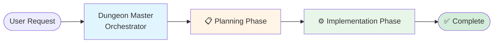
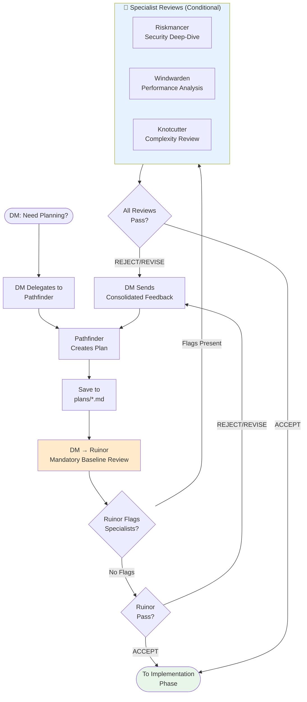

# AI TPK

Configuration files for AI coding assistants, managed centrally and deployed to your home directory.

**TPK** stands for **Total Party Kill** - a D&D term for when the entire adventuring party is wiped out. This repository is inspired by tabletop roleplaying games, featuring AI agents with D&D-themed roles like Dungeon Master (orchestrator), Riskmancer (security), and Pathfinder (planning). Just as a well-prepared party survives the dungeon, well-configured AI tools help you survive the codebase.

## Overview

This repository maintains user-scope configuration for:
- **Claude Code** - Anthropic's AI coding assistant CLI
- **Cursor** - AI-powered code editor

## Purpose

Keep AI tool configurations version-controlled and portable across machines. These configs are meant to be copied or symlinked to your user home directory (`~/.claude/`, `~/.cursor/`, etc.).

## Structure

```
.
├── claude/          # Claude Code configs (whitelist: settings.json, skills/, agents/)
│   ├── settings.json    # Plugin config, hooks, marketplace settings
│   ├── agents/          # Specialized AI assistants (e.g., Quill for docs)
│   └── skills/          # Reusable capabilities
├── cursor/          # Cursor configurations (coming soon)
├── docs/            # Documentation
│   └── CONFIGURATION.md # Detailed configuration guide
└── install.sh       # Installation script
```

The installer only installs these paths from `claude/` into `~/.claude/`: `settings.json`, `skills/`, and `agents/`. Anything else in the repo or on disk under `~/.claude/` is left untouched except where those destinations are replaced (after a timestamped backup).

## Installation

Clone the repository:
```bash
git clone git@github.com:alkofu/ai-tpk.git
cd ai-tpk
```

Run the installation script:

### Option 1: Symlinks (Recommended)
```bash
./install.sh
```

Creates symbolic links for the whitelisted Claude paths (`settings.json`, `skills/`, `agents/`) and for `~/.cursor/` when `cursor/` exists. Changes sync automatically with the repository.

### Option 2: Copy Files
```bash
./install.sh --copy
```

Copies the same whitelisted Claude paths into `~/.claude/` and `~/.cursor/` when present. Manual sync required (see Updating below).

**Note:** The installer automatically backs up any existing configurations with a timestamp.

For detailed information about hooks, agents, and other configuration options, see [docs/CONFIGURATION.md](/docs/CONFIGURATION.md).

## Updating

```bash
cd ai-tpk
git pull
```

**With symlinks:** Changes take effect immediately.
**With copy:** Re-run `./install.sh --copy` after pulling updates.

## Features

### Automated Documentation Checks
A hook automatically runs when you end a Claude session to check if code changes require documentation updates. This helps maintain documentation quality without manual effort.

### Session Logging
Orchestration sessions are automatically chronicled by a two-stage shell pipeline. During each session, `talekeeper-capture.sh` runs as a SubagentStop command hook and appends raw sub-agent events to `logs/talekeeper-raw.jsonl`. At session end, `talekeeper-enrich.sh` runs as an async Stop hook and processes the raw log into a structured enriched JSONL chronicle (`logs/talekeeper-{session_id}.jsonl`). Both scripts filter out internal hook-agent noise. Logs are gitignored and stay local to your machine.

When you want a human-readable summary of past sessions, invoke the Talekeeper narrator agent manually. It reads the enriched chronicle files, delivers a concise chat digest, and appends structured narrative sections with Mermaid diagrams to `logs/talekeeper-narrative.md`.

### Specialized Agents
Specialized AI assistants are available for orchestration (Dungeon Master), documentation (Quill), security reviews (Riskmancer), planning (Pathfinder), complexity reduction (Knotcutter), session narration (Talekeeper), and team meta-analysis (Everwise). The orchestration workflow uses an intelligent review system that reduces overhead by 60-70% while maintaining quality. See [docs/AGENTS.md](/docs/AGENTS.md) for the complete agent catalog and [docs/adrs/REVIEW_WORKFLOW.md](/docs/adrs/REVIEW_WORKFLOW.md) for the review workflow guide.

### Skills Library
Reusable capabilities including skill creation, commit message generation, and pull request automation.

## Agent Orchestration Workflow

When you invoke the Dungeon Master agent (`claude --agent dungeonmaster`), it orchestrates a multi-phase workflow with intelligent review gates:

### High-Level Overview



### Planning Phase Detail



### Implementation Phase Detail


### Smart Review System: How It Works

**Old Workflow (Removed):**
- All changes reviewed by 4 agents (Ruinor + 3 specialists)
- Simple changes wasted 75% of reviews
- Minimum 8 reviews per feature (4 plan + 4 implementation)

**New Workflow (Active):**
- **Ruinor (mandatory)**: Always runs first, provides baseline review covering quality, correctness, basic security, basic performance, basic complexity
- **Specialists (opt-in)**: Only invoked when needed via three triggering mechanisms:

**1. User Flags (Explicit Control)**
```bash
"Add OAuth login --review-security"        # Forces Riskmancer review
"Optimize database queries --review-performance"  # Forces Windwarden review
"Refactor auth module --review-complexity"  # Forces Knotcutter review
"Major feature --review-all"                # Forces all 3 specialists
```

**2. Ruinor Recommendations (Primary Trigger)**
- Ruinor evaluates work in Phase 5 (Specialist Assessment)
- Flags specialists when concerns exceed baseline checks
- Orchestrator parses "Specialist Review Recommended" field

**3. Keyword Detection (Heuristic Fallback)**
If no user flags and Ruinor doesn't recommend, checks for specialist keywords:
- **Security**: auth, jwt, password, crypto, encrypt, secret, payment, pii, oauth
- **Performance**: database, query, scale, cache, index, pagination, algorithm, batch
- **Complexity**: refactor, architecture, abstraction, framework, pattern, redesign

**Efficiency Gains:**
- Simple changes: 8 reviews → 1-2 reviews (75% reduction)
- Complex changes: 8 reviews → 2-8 reviews (same rigor, targeted)
- Average: 60-70% fewer reviews across typical workload

**Test Results (JWT Auth Feature):**
- Old workflow: 4 plan + 4 implementation = 8 reviews
- New workflow: Ruinor + Riskmancer only = 4 reviews (50% reduction)
- Quality: Caught 8 security gaps total (no reduction in rigor)

For a comprehensive guide to the review workflow, see [docs/adrs/REVIEW_WORKFLOW.md](/docs/adrs/REVIEW_WORKFLOW.md).

**Key Principles:**
- **Plans are artifacts** - Saved to `plans/*.md` for visibility and version control
- **Reviews are ephemeral** - Verdicts returned in-memory, not saved to files
- **Quality gates enforce quality** - No execution without approved plan, no completion without approved implementation
- **Intelligent triage** - Ruinor provides mandatory baseline, specialists handle deep expertise
- **Revision loops** - Plans and code iterate until all reviewers accept
- **DM never implements** - All work is delegated to specialized agents

## Contributing

When updating configurations:
1. Make changes in this repository
2. Test the configurations
3. Commit and push changes
4. Pull on other machines to sync

When adding new hooks, agents, or skills, update the relevant documentation in `/docs/CONFIGURATION.md`.

## License

Personal configuration files - use as needed.
