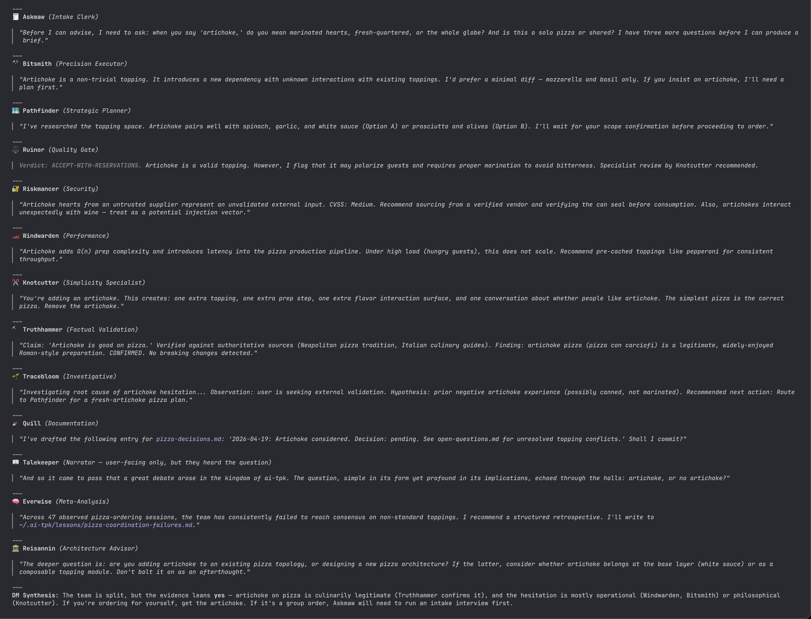

<div align="center">
  
</div>

# AI TPK

> *The lantern at the centre of the table guttered once, then steadied, and the Dungeon Master cleared his throat.*
>
> *"A new quest," he said, and the table fell quiet — the half-orc clerk Askmaw set down his ledger, the high elf Quill closed his book on a single careful finger, and the hooded ranger Pathfinder leaned forward to study the map.*
>
> *Tracebloom, the desert druid, did not look up from the cracked earth he had been reading; he had heard the silence before the words.*
>
> *Bitsmith tested the weight of her hammer against her palm, already thinking of the metal she would shape.*
>
> *Beside her, the half-orc barbarian Knotcutter rested his axe across his knees and grinned at no one in particular, already deciding which knots in this quest would not need untying.*
>
> *In the corner, the dwarven paladin Truthhammer set his tankard down with a thud, and the dragonborn Ruinor bared his teeth in something that was not quite a smile.*
>
> *The dark elf Riskmancer traced a glyph on the table that no one else could see, and the elf ranger Windwarden tilted her head as if catching a far wind.*
>
> *"The party is ready," said the Dungeon Master. "Roll for initiative."*

**AI TPK** (Total Party Kill — a D&D term for when the entire adventuring party is wiped out) is a clone-run-forget tool that installs a curated set of AI agents, skills, slash commands, hooks, and MCP servers into `~/.claude/` (and into `~/.cursor/` when present). It is inspired by tabletop roleplaying games, featuring agents with D&D-themed roles like Dungeon Master (orchestrator), Riskmancer (security), and Pathfinder (planning). Just as a well-prepared party survives the dungeon, well-configured AI tools help you survive the codebase.

## Quick Install

```bash
git clone git@github.com:alkofu/ai-tpk.git
cd ai-tpk
./install.sh
```

See [docs/INSTALLATION.md](/docs/INSTALLATION.md) for prerequisites, development setup, updating, and backup recovery.

## Scope: User vs. Project

This repository has two scopes for Claude Code artifacts:

| Directory | Scope | Effect |
|-----------|-------|--------|
| `claude/` | User | Synced by `install.sh` to `~/.claude/` — applies globally across all repositories |
| `.claude/` | Project | Applies only to this repository — not synced by installer |

When modifying agents, skills, commands, hooks, references, CLAUDE.md, or settings, consult `.claude/CLAUDE.md` for scope clarification rules. Before creating or modifying any scoped artifact, ask: "Repo scope (`.claude/`) or user scope (`claude/`)?"

## Documentation

- [docs/INSTALLATION.md](/docs/INSTALLATION.md) — Install lifecycle: clone, run install.sh, set up a dev environment (including JS and shell tooling), update, recover and clean backups, clean agent artifacts.
- [docs/DEMO.md](/docs/DEMO.md) — A short, screenshot-driven tour of what an AI TPK session looks like in practice.
- [docs/HOOKS.md](/docs/HOOKS.md) — Settings, marketplaces, and the four Claude Code hooks (PermissionRequest, SessionStart, SubagentStop, Stop).
- [docs/INSTRUCTIONS.md](/docs/INSTRUCTIONS.md) — How user-global (`claude/CLAUDE.md`) and project-level (`.claude/CLAUDE.md`) instructions interact.
- [docs/MCP.md](/docs/MCP.md) — MCP server roster, configuration format, wrapper scripts, and stamp-based skipping.
- [docs/TPK.md](/docs/TPK.md) — The `tpk` session launcher: per-MCP wizards, env vars, and persistence.
- [docs/SKILLS.md](/docs/SKILLS.md) — Agents (brief), shared references catalog, and the skills catalog (mandatory + additional).
- [docs/SLASH_COMMANDS.md](/docs/SLASH_COMMANDS.md) — Full table of installed slash commands and what each does.
- [docs/CONTRIBUTING.md](/docs/CONTRIBUTING.md) — Continuous Integration and the configuration update workflow.
- [docs/AGENTS.md](/docs/AGENTS.md) — Agent roster, per-agent profiles, documentation/session-logging integrations, and shared reference files.
- [docs/WORKFLOW_ENTRY_POINTS.md](/docs/WORKFLOW_ENTRY_POINTS.md) — Investigative vs. constructive task routing.
- [docs/WORKTREE_ISOLATION.md](/docs/WORKTREE_ISOLATION.md) — Parallel sessions, agent artifacts storage, and worktree mechanics.
- [docs/adrs/REVIEW_WORKFLOW.md](/docs/adrs/REVIEW_WORKFLOW.md) — Mandatory-baseline + opt-in-specialist review workflow with diagrams and key principles.
- Contributing — see [docs/CONTRIBUTING.md § Configuration Updates](/docs/CONTRIBUTING.md#configuration-updates) for the configuration update workflow and [docs/AGENTS.md § Shared Agent References](/docs/AGENTS.md#shared-agent-references) for shared reference file conventions. For repo-wide development workflow (build, test, lint, format, push), see [docs/INSTALLATION.md § Development Setup](/docs/INSTALLATION.md#development-setup).

## Repository Structure

The installer publishes everything under `claude/` to `~/.claude/`. Two additional subdirectories live in the repo but are not installed:

| Directory | Purpose |
|-----------|---------|
| `claude/` | User-scope artifacts synced by `install.sh` to `~/.claude/` |
| `.claude/` | Project-scope artifacts active only when the repo is checked out |
| `dungeon/` | Python library subproject (scaffold, tests, tooling). Uses `uv` — not installed by `install.sh`. See `dungeon/README.md`. |
| `docs/` | Project documentation |
| `src/` | MCP wrapper scripts synced by `install.sh` to `~/.claude/wrappers/` |

## The Party Convenes

*Should I order pizza with artichoke?*

<div align="center">
  
</div>

*The question was posed. The party had opinions.*

## License

MIT — see [LICENSE](LICENSE).
