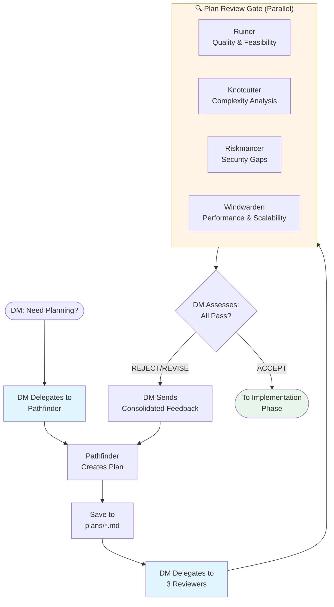
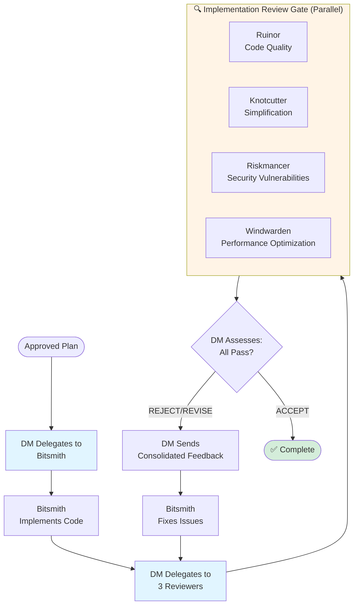

# AI TPK

Configuration files for AI coding assistants, managed centrally and deployed to your home directory.

**TPK** stands for **Total Party Kill** - a D&D term for when the entire adventuring party is wiped out. This repository is inspired by tabletop roleplaying games, featuring AI agents with D&D-themed roles like Dungeon Master (orchestrator), Riskmancer (security), and Pathfinder (planning). Just as a well-prepared party survives the dungeon, well-configured AI tools help you survive the codebase.

## Overview

This repository maintains user-scope configuration for:
- **Claude Code** - Anthropic's AI coding assistant CLI
- **Cursor** - AI-powered code editor

## Purpose

Keep AI tool configurations version-controlled and portable across machines. These configs are meant to be copied or symlinked to your user home directory (`~/.claude/`, `~/.cursor/`, etc.).

## Structure

```
.
├── claude/          # Claude Code configs (whitelist: settings.json, skills/, agents/)
│   ├── settings.json    # Plugin config, hooks, marketplace settings
│   ├── agents/          # Specialized AI assistants (e.g., Quill for docs)
│   └── skills/          # Reusable capabilities
├── cursor/          # Cursor configurations (coming soon)
├── docs/            # Documentation
│   └── CONFIGURATION.md # Detailed configuration guide
└── install.sh       # Installation script
```

The installer only installs these paths from `claude/` into `~/.claude/`: `settings.json`, `skills/`, and `agents/`. Anything else in the repo or on disk under `~/.claude/` is left untouched except where those destinations are replaced (after a timestamped backup).

## Installation

Clone the repository:
```bash
git clone git@github.com:alkofu/ai-tpk.git
cd ai-tpk
```

Run the installation script:

### Option 1: Symlinks (Recommended)
```bash
./install.sh
```

Creates symbolic links for the whitelisted Claude paths (`settings.json`, `skills/`, `agents/`) and for `~/.cursor/` when `cursor/` exists. Changes sync automatically with the repository.

### Option 2: Copy Files
```bash
./install.sh --copy
```

Copies the same whitelisted Claude paths into `~/.claude/` and `~/.cursor/` when present. Manual sync required (see Updating below).

**Note:** The installer automatically backs up any existing configurations with a timestamp.

For detailed information about hooks, agents, and other configuration options, see [docs/CONFIGURATION.md](/docs/CONFIGURATION.md).

## Updating

```bash
cd ai-tpk
git pull
```

**With symlinks:** Changes take effect immediately.
**With copy:** Re-run `./install.sh --copy` after pulling updates.

## Features

### Automated Documentation Checks
A hook automatically runs when you end a Claude session to check if code changes require documentation updates. This helps maintain documentation quality without manual effort.

### Session Logging
Orchestration sessions are automatically chronicled by hook-driven capture. A command hook records raw sub-agent events during the session, and the Talekeeper agent produces an enriched JSONL chronicle at session end. Logs are gitignored and stay local to your machine.

### Specialized Agents
Specialized AI assistants are available for orchestration (Dungeon Master), documentation (Quill), security reviews (Riskmancer), planning (Pathfinder), complexity reduction (Knotcutter), and session logging (Talekeeper). See [docs/AGENTS.md](/docs/AGENTS.md) for the complete agent catalog.

### Skills Library
Reusable capabilities including skill creation, commit message generation, and pull request automation.

## Agent Orchestration Workflow

When you invoke the Dungeon Master agent (`claude --agent dungeonmaster`), it orchestrates a multi-phase workflow with quality gates:

### High-Level Overview


### Planning Phase Detail



### Implementation Phase Detail



**Key Principles:**
- **Plans are artifacts** - Saved to `plans/*.md` for visibility and version control
- **Reviews are ephemeral** - Verdicts returned in-memory, not saved to files
- **Quality gates enforce quality** - No execution without approved plan, no completion without approved implementation
- **Parallel reviews** - All four reviewers run simultaneously for efficiency
- **Revision loops** - Plans and code iterate until all reviewers accept
- **DM never implements** - All work is delegated to specialized agents

## Contributing

When updating configurations:
1. Make changes in this repository
2. Test the configurations
3. Commit and push changes
4. Pull on other machines to sync

When adding new hooks, agents, or skills, update the relevant documentation in `/docs/CONFIGURATION.md`.

## License

Personal configuration files - use as needed.
