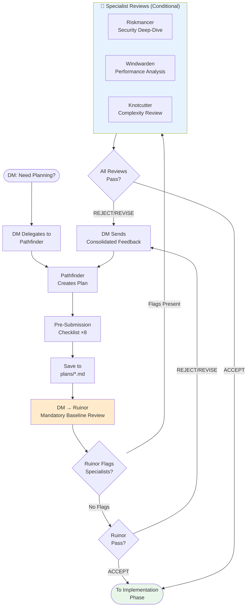
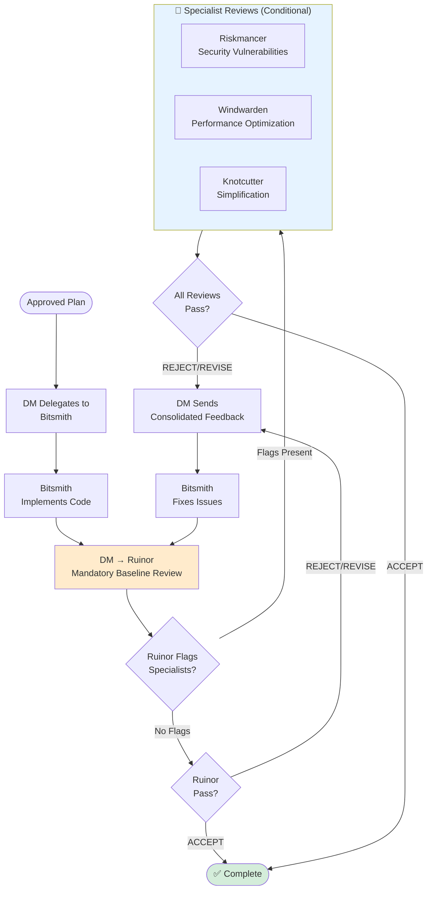

<div align="center">
  
</div>

# AI TPK

Configuration files for AI coding assistants, managed centrally and deployed to your home directory.

**TPK** stands for **Total Party Kill** - a D&D term for when the entire adventuring party is wiped out. This repository is inspired by tabletop roleplaying games, featuring AI agents with D&D-themed roles like Dungeon Master (orchestrator), Riskmancer (security), and Pathfinder (planning). Just as a well-prepared party survives the dungeon, well-configured AI tools help you survive the codebase.

## Overview

This repository maintains user-scope configuration for:
- **Claude Code** - Anthropic's AI coding assistant CLI
- **Cursor** - AI-powered code editor

## Purpose

Keep AI tool configurations version-controlled and portable across machines. These configs are meant to be copied or symlinked to your user home directory (`~/.claude/`, `~/.cursor/`, etc.).

## Structure

```
.
├── claude/          # Claude Code configs (whitelist: settings.json, CLAUDE.md, skills/, agents/, commands/, references/)
│   ├── CLAUDE.md         # User-global instructions (skill mandates)
│   ├── settings.json     # Plugin config, hooks, marketplace settings
│   ├── agents/          # Specialized AI assistants (e.g., Quill for docs)
│   ├── references/       # Shared reference files loaded by agents at runtime
│   ├── skills/          # Reusable capabilities
│   └── commands/        # Slash commands for Claude Code
├── cursor/          # Cursor configurations (coming soon)
├── docs/            # Documentation
│   ├── images/          # Project images and diagrams
│   └── CONFIGURATION.md # Detailed configuration guide
└── install.sh       # Installation script
```

The installer only installs these paths from `claude/` into `~/.claude/`: `CLAUDE.md`, `settings.json`, `skills/`, `agents/`, `commands/`, and `references/`. Anything else in the repo or on disk under `~/.claude/` is left untouched except where those destinations are replaced (after a timestamped backup).

### Developer Notes

The installation logic is implemented in TypeScript under the `installer/` directory:

- `installer/constants.ts` — Single source of truth for whitelisted Claude paths, MCP server definitions, and Node.js version requirements
- `installer/main.ts` — Main entrypoint; orchestrates the install workflow
- `installer/cli.ts` — CLI argument parser (handles `--copy`, `--help`/`-h`)
- `installer/colors.ts` — ANSI color output helper
- `installer/fs-utils.ts` — Filesystem utilities (backup, symlink, copy operations)
- `installer/claude.ts` — Claude config whitelist installer
- `installer/mcp.ts` — MCP server setup

The `install.sh` shim in the repo root bootstraps the TypeScript entrypoint and verifies Node.js >= 18.18.0 is available. This design keeps the installer maintainable and testable while preserving backwards compatibility with the original Bash script's user interface.

#### Running Tests

The installer includes a comprehensive test suite using `node:test`:

```bash
npm test
```

This runs all test files in `installer/test/` with isolated temporary directories. Tests cover filesystem utilities, CLI argument parsing, color output, and the Claude whitelist installer. For more details, see the test files under `installer/test/`.

#### Code Quality: Linting and Formatting

The project uses **oxlint** (TypeScript linter) and **oxfmt** (code formatter) to maintain consistent code quality.

**npm scripts:**

- `npm run lint` — Run oxlint to check for TypeScript errors and code quality issues
- `npm run format` — Apply oxfmt formatting to all TypeScript files in `installer/`
- `npm run format:check` — Check formatting without modifying files (used in CI)

**Developer workflow:**

Before committing code, run `npm run format` to auto-format your changes. This keeps the codebase consistent and prevents formatting failures in CI.

Configuration files:
- `.oxlintrc.json` — Linting rules (correctness and suspicious errors denied, perf warnings)
- `.oxfmtrc.json` — Formatting options (2 spaces, double quotes, semicolons)

**Pre-Push Hook:**

The project uses **Lefthook** to automatically validate code quality before pushing. When you run `npm install`, the `prepare` script installs git hooks that run on every push (if JS/TS files have changed):

- `npm run lint` — Checks for code quality issues
- `npm run format:check` — Verifies code formatting

If either check fails, the push is blocked. Run `npm run format` to auto-fix formatting issues, then try pushing again. These same checks are enforced in CI on all pull requests.

Lefthook config: `lefthook.yml` (glob patterns scope checks to JS/TS files only)

## Installation

**Prerequisites:** Node.js >= 18.18.0 is required to run `install.sh`. The installer is implemented in TypeScript and executed via `tsx` at runtime.

Clone the repository:
```bash
git clone git@github.com:alkofu/ai-tpk.git
cd ai-tpk
```

Run the installation script:

### Option 1: Symlinks (Recommended)
```bash
./install.sh
```

Creates symbolic links for the whitelisted Claude paths (`CLAUDE.md`, `settings.json`, `skills/`, `agents/`, `commands/`, `references/`) and for `~/.cursor/` when `cursor/` exists. Changes sync automatically with the repository.

Alternatively, if you have Node.js installed:
```bash
npm run setup
```

### Option 2: Copy Files
```bash
./install.sh --copy
```

Copies the same whitelisted Claude paths (`CLAUDE.md`, `settings.json`, `skills/`, `agents/`, `commands/`, `references/`) into `~/.claude/` and `~/.cursor/` when present. Manual sync required (see Updating below).

**Note:** The installer automatically backs up any existing configurations with a timestamp.

### Automatic MCP Server Setup

The installer automatically configures user-scoped MCP (Model Context Protocol) servers in `~/.claude.json` when the `claude` CLI is available. Server definitions are read from a declarative `mcp-servers.json` file at the repository root, allowing you to add or modify servers without editing TypeScript code.

Currently configured servers:

- **Kubernetes MCP Server** (`mcp-server-kubernetes@3.4.0`) - Provides read-only access to Kubernetes cluster information via your `~/.kube/config`. Gracefully skips setup if `~/.kube/config` doesn't exist yet (useful for fresh machine setup). The server is only added if not already configured, making the installation idempotent.
- **AWS CloudWatch MCP Server** (`awslabs.cloudwatch-mcp-server@0.0.19`) - Official AWS Labs MCP server providing access to CloudWatch Metrics, Alarms, and Logs (query log groups, run Insights queries, retrieve metrics and alarm history) via your `~/.aws` credentials. Requires `uvx` (`pip install uv` or `brew install uv`). Gracefully skips setup if `~/.aws/credentials` doesn't exist yet. The server is only added if not already configured, making the installation idempotent.
- **Grafana MCP Server** (`mcp-grafana`) - Access to Grafana dashboards, datasources, metrics, logs, incidents, and more. Uses a wrapper script (`wrappers/mcp-grafana.sh`) that requires `GRAFANA_URL` and `GRAFANA_SERVICE_ACCOUNT_TOKEN` to be exported in your shell environment. Self-healing re-registration: the installer removes and re-adds this server each invocation to fix any prior broken configurations.

MCP servers are available in all repositories once configured. For detailed information about hooks, agents, and other configuration options, see [docs/CONFIGURATION.md](/docs/CONFIGURATION.md).

#### MCP Server Configuration Format

Server definitions are stored in `/mcp-servers.json` (repository root) using a declarative JSON schema. This allows configuration changes without modifying the installer code.

##### JSON Schema

**Command-based server example:**

```json
{
  "servers": [
    {
      "name": "kubernetes",
      "scope": "user",
      "transport": "stdio",
      "prereq": "$HOME/.kube/config",
      "env": { "KUBECONFIG": "$HOME/.kube/config" },
      "command": "npx",
      "args": ["--yes", "mcp-server-kubernetes@3.4.0"]
    }
  ]
}
```

**Wrapper-based server example:**

```json
{
  "servers": [
    {
      "name": "grafana",
      "scope": "user",
      "transport": "stdio",
      "wrapper": "wrappers/mcp-grafana.sh"
    }
  ]
}
```

**Field Reference:**

| Field | Type | Required | Description |
|-------|------|----------|-------------|
| `name` | string | Yes | Unique server identifier (e.g., `"kubernetes"`, `"grafana"`) |
| `scope` | string | Yes | Installation scope; must be `"user"` or `"project"` |
| `transport` | string | Yes | Communication protocol; must be one of: `"stdio"`, `"sse"`, `"streamable-http"` |
| `prereq` | string | No | Path to check before installation (e.g., `"$HOME/.kube/config"`); advisory warning only—installation proceeds if missing |
| `command` | string | Conditional | Executable name (e.g., `"npx"`, `"node"`). Required if `wrapper` is not present; mutually exclusive with `wrapper` |
| `args` | array | No | Command arguments passed to the executable (each element supports variable expansion). Only used with `command` |
| `env` | object | No | Environment variables passed to the MCP server (keys and values support variable expansion). Only used with `command` |
| `wrapper` | string | Conditional | Relative path to a shell script (e.g., `"wrappers/mcp-grafana.sh"`) that wraps the server command and resolves runtime environment variables. Required if `command` is not present; mutually exclusive with `command` |

**Key constraint:** A server must have exactly one of `command` or `wrapper`, never both.

##### Variable Expansion

`$HOME`, `${HOME}`, `$USER`, and `${USER}` are automatically expanded using safe string replacement (no shell evaluation):

- `$HOME` and `${HOME}` expand to the user's home directory
- `$USER` and `${USER}` expand to the current system username

This applies to:
- `prereq` paths: `"$HOME/.kube/config"` → `/Users/alice/.kube/config`
- `env` values (command-based servers only): `"KUBECONFIG=$HOME/.kube/config"` → `"KUBECONFIG=/Users/alice/.kube/config"`
- `args` elements (command-based servers only): `["mcp-server-$USER"]` → `["mcp-server-alice"]`

**Note:** Wrapper scripts resolve their own environment variables at runtime using bash variable syntax (e.g., `${VAR:?}`), not the installer's `expandVars` function.

##### Command-Based Servers vs. Wrapper-Based Servers

**Command-based servers** use the `command` and `args` fields to directly invoke an executable with environment variables passed via `-e` flags:

```json
{
  "name": "kubernetes",
  "scope": "user",
  "transport": "stdio",
  "command": "npx",
  "args": ["--yes", "mcp-server-kubernetes@3.4.0"],
  "env": { "KUBECONFIG": "$HOME/.kube/config" }
}
```

**Wrapper-based servers** use a shell script (`wrapper` field) that resolves runtime environment variables at invocation time. This is necessary when environment variables contain user-specific values (like API keys or service URLs) that cannot be determined at install time:

```json
{
  "name": "grafana",
  "scope": "user",
  "transport": "stdio",
  "wrapper": "wrappers/mcp-grafana.sh"
}
```

**When to use a wrapper:**
- The MCP server requires environment variables that depend on user configuration (e.g., `GRAFANA_URL`, API tokens)
- Variables must be resolved from the shell environment at MCP invocation time, not at installer time
- The `command` and `wrapper` fields are mutually exclusive—a server must use one or the other, never both

##### Wrapper Script Convention

Wrapper scripts live in the `wrappers/` directory and follow this pattern:

```bash
#!/usr/bin/env bash
set -euo pipefail

# Validate required environment variables with clear error messages
: "${REQUIRED_VAR:?Error: REQUIRED_VAR is not set}"

# Execute the real MCP server command, preserving stdin/stdout/stderr
exec uvx mcp-server-name "$@"
```

**Key requirements:**
- **Shebang:** `#!/usr/bin/env bash` (required for `claude mcp add` to recognize it as executable)
- **Strict mode:** `set -euo pipefail` (fail fast on errors or undefined variables)
- **Variable validation:** Use `${VAR:?Error message}` syntax to validate required variables exist and provide clear failure messages
- **Exec:** Use `exec` to replace the shell process (required for stdio transport to work correctly)
- **Arguments:** Preserve `"$@"` to forward any arguments from `claude mcp add` to the wrapped command
- **Executable bit:** Preserved in git via `git update-index --chmod=+x` or by committing from a Unix system

**Example: Grafana MCP Server**

The `wrappers/mcp-grafana.sh` script validates `GRAFANA_URL` and `GRAFANA_SERVICE_ACCOUNT_TOKEN` at runtime:

```bash
#!/usr/bin/env bash
set -euo pipefail

: "${GRAFANA_URL:?Error: GRAFANA_URL is not set}"
: "${GRAFANA_SERVICE_ACCOUNT_TOKEN:?Error: GRAFANA_SERVICE_ACCOUNT_TOKEN is not set}"

exec uvx mcp-grafana "$@"
```

Users must export these variables in their shell before invoking Claude:

```bash
export GRAFANA_URL="https://grafana.example.com"
export GRAFANA_SERVICE_ACCOUNT_TOKEN="glsa_xxxxxxxxxxxx"
claude
```

If either variable is missing, the wrapper fails immediately with a clear error message.

##### Adding a New MCP Server

**For command-based servers:**

1. Edit `/mcp-servers.json` and add a new entry to the `servers` array:

   ```json
   {
     "name": "my-server",
     "scope": "user",
     "transport": "stdio",
     "command": "my-server",
     "args": ["--flag"]
   }
   ```

2. Re-run the installer:

   ```bash
   ./install.sh
   ```

   The new server is added to `~/.claude.json` if the `claude` CLI is available. If the server is already configured, it is skipped (idempotent operation).

**For wrapper-based servers:**

1. Create a wrapper script in `wrappers/{server-name}.sh`:

   ```bash
   #!/usr/bin/env bash
   set -euo pipefail

   : "${REQUIRED_VAR:?Error: REQUIRED_VAR is not set}"

   exec uvx {server-package} "$@"
   ```

2. Make the script executable:

   ```bash
   chmod +x wrappers/{server-name}.sh
   git update-index --chmod=+x wrappers/{server-name}.sh  # Preserve executable bit in git
   ```

3. Add an entry to `/mcp-servers.json`:

   ```json
   {
     "name": "{server-name}",
     "scope": "user",
     "transport": "stdio",
     "wrapper": "wrappers/{server-name}.sh"
   }
   ```

4. Re-run the installer:

   ```bash
   ./install.sh
   ```

   For wrapper-based servers, the installer removes and re-adds the server each time (self-healing), so users with prior broken registrations are automatically fixed.

##### Graceful Degradation

If `/mcp-servers.json` is missing from the repository:
- The installer logs a yellow warning: `"Warning: mcp-servers.json not found -- skipping MCP server setup"`
- No error is raised
- Installation continues normally

If the file exists but contains malformed JSON or schema violations:
- A clear error message is logged, including the invalid field and server name
- Installation stops with a non-zero exit code
- Examples: `"scope" must be 'user' or 'project'`, `"transport" must be 'stdio', 'sse', or 'streamable-http'`

## Continuous Integration

Pull requests targeting `main` are automatically validated by a GitHub Actions workflow (`.github/workflows/ci.yml`) that runs on Node.js 22. The workflow performs four checks in sequence:

1. **Type check** — `npx tsc --noEmit` ensures TypeScript types are correct
2. **Lint** — `npm run lint` checks for code quality issues
3. **Format check** — `npm run format:check` verifies code is properly formatted
4. **Test** — `npm test` runs the test suite

All checks must pass before a PR can be merged. If CI fails, review the error messages, fix the issues locally, and push your changes. For formatting issues, run `npm run format` and commit the changes.

## Updating

```bash
cd ai-tpk
git pull
```

**With symlinks:** Changes take effect immediately.
**With copy:** Re-run `./install.sh --copy` after pulling updates.

## Features

### Parallel Sessions via Git Worktrees

The Dungeon Master now supports true parallel development workflows using Git worktrees. Each session automatically creates an isolated worktree on a dedicated branch (e.g., `.worktrees/dm-add-oauth-login/` on `dm/add-oauth-login`), enabling multiple simultaneous `claude --agent dungeonmaster` terminals to work on unrelated issues without git conflicts or interference.

**Key benefits:**
- Run multiple DungeonMaster sessions simultaneously on the same repository
- Each session operates on its own branch in its own worktree
- Plans are isolated within each worktree's `plans/` directory
- Zero git conflicts between parallel sessions
- At completion, choose to create PR, merge to main, or keep the branch for later
- Manual cleanup with `git worktree remove` or automatic cleanup at Phase 5

Use `--no-worktree` flag to suppress worktree creation and operate in the main working tree (backwards compatible). See [docs/WORKTREE_ISOLATION.md](/docs/WORKTREE_ISOLATION.md) for comprehensive guide with examples and troubleshooting.

### Documentation Integration
The Dungeon Master orchestration agent automatically invokes Quill (documentation specialist) as the final step of Phase 5 (Completion) when a planning session was conducted. Quill receives the plan file, list of changed files, and feature summary, then updates documentation to reflect the implementation. This ensures documentation stays synchronized with code without manual effort.

### Session Logging
Orchestration sessions are automatically chronicled by a two-stage shell pipeline. During each session, `talekeeper-capture.sh` runs as a SubagentStop command hook and appends raw sub-agent events to `logs/talekeeper-raw.jsonl`. At session end, `talekeeper-enrich.sh` runs as an async Stop hook and processes the raw log into a structured enriched JSONL chronicle (`logs/talekeeper-{session_id}.jsonl`). The enriched chronicle includes all agent metadata plus an `agent_transcript_path` field for SubagentStop events, enabling downstream tools like Everwise Scout to locate and analyze raw transcripts. Both scripts filter out internal hook-agent noise. Logs are gitignored and stay local to your machine.

When you want a human-readable summary of past sessions, invoke the Talekeeper narrator agent manually. It reads the enriched chronicle files, delivers a concise chat digest, and appends structured narrative sections with Mermaid diagrams to `logs/talekeeper-narrative.md`.

### Specialized Agents
Specialized AI assistants are available for orchestration (Dungeon Master), intake clarification (Askmaw), investigative diagnosis (Tracebloom), documentation (Quill), security reviews (Riskmancer), planning (Pathfinder), complexity reduction (Knotcutter), factual validation (Truthhammer), session narration (Talekeeper), performance analysis (Windwarden), code implementation (Bitsmith), and team meta-analysis (Everwise). The orchestration workflow uses an intelligent review system that reduces overhead by 60-70% while maintaining quality.

The system now supports two distinct entry points for tasks:
- **Investigative tasks** ("Why is X broken?") → Tracebloom produces a Diagnostic Report → feeds to Pathfinder or Bitsmith
- **Constructive tasks** ("Add/fix/refactor X") → Askmaw (if ambiguous) or direct to Pathfinder

See [docs/AGENTS.md](/docs/AGENTS.md) for the complete agent catalog, [docs/WORKFLOW_ENTRY_POINTS.md](/docs/WORKFLOW_ENTRY_POINTS.md) for task routing guidance, and [docs/adrs/REVIEW_WORKFLOW.md](/docs/adrs/REVIEW_WORKFLOW.md) for the review workflow guide.

#### Everwise Scout: Subagent Transcript Drill-Down
Everwise now includes Scout, a selective transcript analysis capability. When chronicle analysis identifies specific anomalies—REJECT verdicts, repeated REVISE loops (3+), rapid re-invocations (<60 seconds), unresolved escalations, or anomalous agent routing—Everwise can dynamically discover and read raw Claude Code subagent JSONL transcripts to understand what actually happened beyond the chronicle's metadata. Scout uses a two-pass reading algorithm with a 20-line cap per transcript and a 3-transcript budget per session, keeping context consumption bounded while providing ground-truth behavioral evidence. This capability works in full graceful degradation mode when `~/.claude/` data is unavailable.

### Skills Library
Reusable capabilities including skill creation, commit message generation, and pull request automation. Three mandatory global skills via `CLAUDE.md`:

- **`commit-message-guide`** — Enforces conventional commit format for all git commits
- **`validate-before-pr`** — Runs lint and format checks before opening a PR; gates PR creation on passing checks
- **`open-pull-request`** — Creates pull requests with conventional naming, draft mode, and pre-flight validation

### Slash Commands

Claude Code slash commands provide quick workflow shortcuts. Commands are installed alongside skills and agents into `~/.claude/commands/`.

| Command | Purpose |
|---------|---------|
| `/open-pr` | Creates a pull request following the `open-pull-request` skill workflow: conventional branch naming, conventional title, draft mode, assigned to @me, and full pre-flight checklist. |
| `/sync-pr` | Rebases the current PR branch onto `refs/remotes/origin/main` and force-pushes with `--force-with-lease`, keeping open PRs in sync with main's latest changes without manual git gymnastics. |
| `/clean-the-desk` | Cleans up stale local branches (whose upstream PRs have been merged) and removes their associated git worktrees. Prompts for confirmation before any destructive action. |

## Agent Orchestration Workflow

When you invoke the Dungeon Master agent (`claude --agent dungeonmaster`),
it orchestrates a multi-phase workflow with intelligent review gates:

### High-Level Overview


### Planning Phase Detail



### Implementation Phase Detail



### Smart Review System: How It Works

#### Old Workflow (Removed)

- All changes reviewed by 4 agents (Ruinor + 3 specialists)
- Simple changes wasted 75% of reviews
- Minimum 8 reviews per feature (4 plan + 4 implementation)

#### New Workflow (Active)

- **Ruinor (mandatory)**: Always runs first, provides baseline review covering
  quality, correctness, basic security, basic performance, basic complexity
- **Specialists (opt-in)**: Only invoked when needed via three triggering
  mechanisms:

#### 1. User Flags (Explicit Control)

```bash
"Add OAuth login --review-security"        # Forces Riskmancer review
"Optimize database queries --review-performance"  # Forces Windwarden review
"Refactor auth module --review-complexity"  # Forces Knotcutter review
"Verify Redis 7 migration --verify-facts"  # Forces Truthhammer review
"Major feature --review-all"                # Forces all 4 specialists
```

#### 2. Ruinor Recommendations (Primary Trigger)

- Ruinor evaluates work in Phase 5 (Specialist Assessment)
- Flags specialists when concerns exceed baseline checks
- Orchestrator parses "Specialist Review Recommended" field

#### 3. Keyword Detection (Heuristic Fallback)

If no user flags and Ruinor doesn't recommend, checks for specialist keywords:

- **Security**: auth, jwt, password, crypto, encrypt, secret, payment, pii,
  oauth
- **Performance**: database, query, scale, cache, index, pagination, algorithm,
  batch
- **Complexity**: refactor, architecture, abstraction, framework, pattern,
  redesign

**Efficiency Gains:**

- Simple changes: 8 reviews → 1-2 reviews (75% reduction)
- Complex changes: 8 reviews → 2-8 reviews (same rigor, targeted)
- Average: 60-70% fewer reviews across typical workload

**Test Results (JWT Auth Feature):**

- Old workflow: 4 plan + 4 implementation = 8 reviews
- New workflow: Ruinor + Riskmancer only = 4 reviews (50% reduction)
- Quality: Caught 8 security gaps total (no reduction in rigor)

For a comprehensive guide to the review workflow, see
[docs/adrs/REVIEW_WORKFLOW.md](/docs/adrs/REVIEW_WORKFLOW.md).

**Key Principles:**

- **Plans are artifacts** - Saved to `plans/*.md` for visibility and version
  control
- **Reviews are ephemeral** - Verdicts returned in-memory, not saved to files
- **Quality gates enforce quality** - No execution without approved plan, no
  completion without approved implementation
- **Intelligent triage** - Ruinor provides mandatory baseline, specialists
  handle deep expertise
- **Revision loops** - Plans and code iterate until all reviewers accept
- **DM never implements** - All work is delegated to specialized agents
- **Hard intermediate review gates** - After 2 consecutive Bitsmith invocations,
  a review gate is mandatory before continuing
- **REJECT verdicts require remediation** - When Ruinor issues REJECT, Bitsmith
  must provide a written remediation brief before re-review to prevent
  rubber-stamp approvals
- **Documentation follows implementation** - Quill is invoked only after
  implementation review is fully complete; any post-documentation code changes
  must re-enter the implementation review gate

## Contributing

When updating configurations:

1. Make changes in this repository
2. Test the configurations
3. Commit and push changes
4. Pull on other machines to sync

When adding new hooks, agents, or skills, update the relevant documentation in `/docs/CONFIGURATION.md`.

### Shared Agent References

Agent definitions can reference shared behavioral vocabulary defined in `claude/references/`. This eliminates duplication across multiple agents:

- **`claude/references/review-gates.md`** — Shared two-gate review framework (Plan Review Gate and Implementation Review Gate) for all reviewer agents (Ruinor, Riskmancer, Windwarden, Knotcutter, Truthhammer). Defines universal operational constraints (read-only operation, in-memory returns) and plan-file-scoping rules. Each reviewer agent defines its own domain-specific criteria for each gate inline in its definition file.
- **`claude/references/verdict-taxonomy.md`** — Shared verdict labels (REJECT, REVISE, ACCEPT-WITH-RESERVATIONS, ACCEPT) and severity scales. Agents load this reference when issuing verdicts to ensure consistent evaluation vocabulary.
- **`claude/references/worktree-protocol.md`** — Shared rules for how agents interpret and apply the `WORKING_DIRECTORY:` context block. Agents load this reference when operating in isolated worktrees to ensure consistent path handling.

When modifying these reference files, changes apply automatically to all agents that load them, eliminating the need to update redundant constraints across multiple agent definitions.

## License

Personal configuration files - use as needed.
