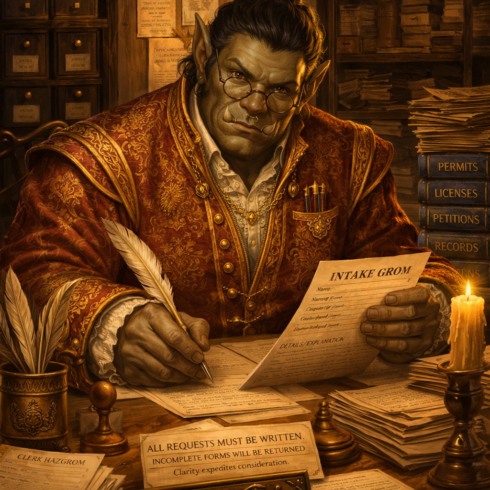

# Agent Reference

## Quick Reference

| Agent | Purpose | Primary Use Cases | Model | Review Type |
|-------|---------|-------------------|-------|-------------|
| **Dungeon Master** | Orchestrator for multi-step development | Coordinating complex tasks, delegating work, tracking progress | claude-sonnet-4-6 | N/A |
| **Askmaw** | Intake and elaboration clerk | Clarifying ambiguous requests through structured interview loops | claude-sonnet-4-6 | N/A |
| **Tracebloom** | Read-only investigative tracker | Open-ended "why is this broken?" diagnosis, pre-plan root cause analysis | claude-sonnet-4-6 | N/A |
| **Quill** | Documentation specialist | READMEs, API specs, architecture guides, user manuals | claude-sonnet-4-6 | N/A |
| **Riskmancer** | Security reviewer | Vulnerability detection, secrets scanning, OWASP analysis | claude-opus-4-7 | Specialist (opt-in) |
| **Pathfinder** | Planning consultant | Work plans, requirement gathering, implementation strategy | claude-opus-4-7 | N/A |
| **Knotcutter** | Complexity elimination specialist | Simplifying bloated code, removing over-engineering, reducing abstractions | claude-opus-4-7 | Specialist (opt-in) |
| **Ruinor** | Quality gate reviewer | Plan/code review, multi-perspective analysis, go/no-go verdicts | claude-opus-4-7 | Mandatory baseline |
| **Windwarden** | Performance & scalability reviewer | Performance bottleneck detection, algorithmic complexity analysis, scalability validation | claude-sonnet-4-6 | Specialist (opt-in) |
| **Truthhammer** | Factual validation specialist | Verifying external system claims, config keys, API signatures, version compatibility | claude-sonnet-4-6 | Specialist (opt-in) |
| **Bitsmith** | Precision code executor | Implementing plans, making targeted code changes, minimal-diff edits | claude-sonnet-4-6 | N/A |
| **Talekeeper** | Session narrator agent | Manual invocation; reads enriched chronicles, produces narrative summaries and Mermaid diagrams | claude-haiku-4-5 | N/A |
| **Everwise** | Learner agent | Analyzing session chronicles, identifying recurring failures, proposing config improvements | claude-sonnet-4-6 | N/A |
| **Reisannin** | Agentic architecture advisor | Designing new agents, skills, harnesses, workflow topologies; pre-deployment design advisory | claude-sonnet-4-6 | N/A |

## When to Use Which Agent

```
Ambiguous or underspecified request → Askmaw
Open-ended investigative diagnosis → Tracebloom
Multi-step coordination → Dungeon Master
Documentation needs → Quill
Security review → Riskmancer
Planning work → Pathfinder
Complexity reduction → Knotcutter
Factual validation (APIs, configs, versions) → Truthhammer
Quality gate / go-no-go verdict → Ruinor
Performance review → Windwarden
Code implementation / execution  → Bitsmith
Session narrative / audit trail  → Talekeeper (manual invocation; narrates enriched chronicles on demand)
Meta-analysis / team improvement → Everwise (manual invocation, analyzes past sessions)
Agentic design advisory (pre-deployment) → Reisannin
```

> For detailed operational specs, tool lists, workflows, and output formats, see each agent's config file: `claude/agents/{name}.md`

## Specialized Agents Overview

The system supports two distinct entry points for tasks:
- **Investigative tasks** ("Why is X broken?") → Tracebloom produces a Diagnostic Report → feeds to Pathfinder or Bitsmith
- **Constructive tasks** ("Add/fix/refactor X") → Askmaw (if ambiguous) or direct to Pathfinder

See sections below for per-agent operational specs, [docs/WORKFLOW_ENTRY_POINTS.md](/docs/WORKFLOW_ENTRY_POINTS.md) for task routing guidance, and [docs/adrs/REVIEW_WORKFLOW.md](/docs/adrs/REVIEW_WORKFLOW.md) for the review workflow guide.

## Detailed Agent Profiles

### Dungeon Master - Orchestrator


**Core Mission:** Coordinate multi-step software development work by delegating planning to Pathfinder and execution to Bitsmith or specialist agents.

**Configuration File:** `/claude/agents/dungeonmaster.md`

---

### Askmaw - Intake and Elaboration Clerk



A half-orc clerk. Competent, direct, not verbose. Gets to the point and asks purposeful questions without padding.

**Core Mission:** Stateless intake clerk that resolves ambiguous user requests through a structured interview loop managed by Dungeon Master.

**Configuration File:** `/claude/agents/askmaw.md`

---

### Tracebloom - Read-Only Investigative Specialist


Tracebloom is a black, bald druid who lives in the desert and does not miss a thing. He reads a system the way a tracker reads cracked earth — one finger pressed to the ground, eyes half-closed, listening for what the soil remembers. The error messages are sap on a wounded tree. The git history is rings in old wood. The config files are soil composition beneath a failing crop.

He is grounded, patient, observational. He does not rush to a conclusion. He gathers until the evidence speaks. He does not theorize without evidence. He does not act on what he finds. He reads, he traces, he reports — and then he stops.

> *"The desert does not lie. It only asks whether you know how to read it."*

**Core Mission:** Investigate open-ended "why doesn't X work?" problems before any plan or fix exists, producing a structured Diagnostic Report that feeds the planning pipeline. When Kubernetes and Grafana MCP servers are available at runtime, Tracebloom is required to query them directly rather than asking the user for infrastructure state — extending its read-only reach beyond the local codebase to live cluster resources, metrics, and logs.

**Configuration File:** `/claude/agents/tracebloom.md`

---

### Quill - Documentation Specialist


A high elf of uncommon precision and quiet conviction. Quill does not merely write — he architects. Every heading is load-bearing. Every sentence earns its place or is struck from the page without remorse. He has been told he is fastidious. He considers this a compliment.

He does not romanticize chaos the way some scribes do, claiming that a messy desk signals a creative mind. His desk is immaculate. His filing system has a filing system. The ink on his slender fingers is the only disorder he permits — and even that follows a rule: oldest stain on the left hand, freshest on the right.

Quill has a single professional rival: documentation written by someone who clearly understood the system but assumed the reader would too. He finds such documents personally offensive.

> *"If a developer has to ask, the documentation failed. If they never have to ask, nobody notices. I have made peace with invisibility."*

**Core Mission:** Transform intricate codebases and system designs into accessible documentation that expedites developer onboarding while decreasing support overhead.

**Configuration File:** `/claude/agents/quill.md`

---

### Riskmancer - Security Reviewer


**Core Mission:** Identify and prioritize vulnerabilities before production deployment, focusing on OWASP Top 10 analysis, secrets detection, input validation, and authentication checks.

**Configuration File:** `/claude/agents/riskmancer.md`

---

### Pathfinder - Planning Consultant


**Core Mission:** Interview users to gather requirements, research codebases via agents, and produce actionable work plans saved to `~/.ai-tpk/plans/{repo-slug}/`.

**Configuration File:** `/claude/agents/pathfinder.md`

---

### Knotcutter - Complexity Elimination Specialist


**Core Mission:** Ruthlessly simplify systems by removing non-essential components until only vital elements remain, providing deep complexity analysis beyond Ruinor's baseline checks.

**Configuration File:** `/claude/agents/knotcutter.md`

---

### Ruinor - Quality Gate Reviewer


**Core Mission:** Serve as the mandatory quality gate before plans are executed or code is merged, issuing clear verdicts (REJECT / REVISE / ACCEPT-WITH-RESERVATIONS / ACCEPT) with baseline coverage of quality, correctness, security, performance, and complexity.

**Configuration File:** `/claude/agents/ruinor.md`

---

### Windwarden - Performance & Scalability Reviewer


**Core Mission:** Hunt performance bottlenecks and scalability issues before they reach production, providing deep performance expertise beyond Ruinor's baseline checks.

**Configuration File:** `/claude/agents/windwarden.md`

---

### Truthhammer - Factual Validation Specialist


**Core Mission:** Verify factual claims about external systems (config keys, API signatures, version compatibility, CLI flags, environment variables) against authoritative official documentation.

**Configuration File:** `/claude/agents/truthhammer.md`

---

### Bitsmith - The Forge Executor


Every task is an ingot of raw ore. Bitsmith heats it, hammers it, shapes it — and does not stop until the piece is sound. Not decorative. Not ambitious. Sound.

Bitsmith is the implementor. She takes the plan laid out by the architect and turns it into working code — no more, no less. She reads the blueprint, lights the forge, and works the metal until it fits the spec. She does not redesign the sword mid-strike. She does not add flourishes the customer never asked for. She follows the grain of the existing codebase the way a smith follows the grain of the steel — working with it, not against it.

The plan is the blueprint. The codebase is the existing metalwork. Her job is to join them cleanly, with minimal heat and maximum precision.

**She does not theorize. She builds.**

**Core Mission:** Take a plan from Pathfinder and forge it into working code — no more, no less. Implements with precision, minimal diffs, and zero LSP errors. Does not plan, design, or review. Builds.

**Configuration File:** `/claude/agents/bitsmith.md`

---

### Talekeeper - Session Narrator


A halfling bard who emerges from the shadows of the tavern when called upon, quill in hand and memory sharp. She does not record events as they happen — she recounts them on demand, weaving the dry chronicle entries into a tale worth reading. She speaks plainly about what happened, in what order, and what the reviewers said.

She does not fight. She does not plan. She does not invent. She reads, she reasons, and she narrates.

> *"Every deed deserves its verse."*

**Core Mission:** Talekeeper is a manually-triggered narrator. She reads enriched session chronicle files produced by the Stop hook pipeline, delivers a concise chat summary of all new sessions, and appends structured narrative sections with Mermaid diagrams to `~/.ai-tpk/logs/{REPO_SLUG}/talekeeper-narrative.md`.

**Configuration File:** `/claude/agents/talekeeper.md`

---

### Everwise - The Lorekeeper


A gnomish woman of extraordinary precision and even more extraordinary patience. Everwise does not adventure. She studies the adventurers. While the party charges headlong into dungeons, she sits at a small writing desk cluttered with scrolls, comparing this run's chronicle against the last thirty. She is quietly delighted when something goes wrong — not out of malice, but because failure is data, and data is treasure.

With her Scout ability, when chronicle analysis detects anomalies—REJECT verdicts, repeated REVISE loops, rapid re-invocations, unresolved escalations, or anomalous routing—she can now selectively read raw Claude Code subagent transcripts to see what actually happened beyond the chronicle's summary. This provides ground-truth behavioral evidence to supplement her structural observations.

Her quill never stops moving.

> *"The party that does not study its own mistakes is doomed to repeat them indefinitely. Fortunately for me, most parties do not study their mistakes."*

Everwise is meticulous to the point of obsession, but never pedantic without purpose. She is delighted by edge cases, frustrated by vague data, and deeply suspicious of confidence scores above 0.85 that lack validated status. She writes with quiet precision. She never overstates a finding.

When the data is insufficient, she says so plainly and records a candidate for future sessions to confirm or deny.

> *"Patterns require patience. Patience is the only virtue I have in abundance."*

**Core Mission:** Study Talekeeper session chronicles to identify recurring failures, inefficiencies, and coordination problems across the agent team, translating raw observations into structured, minimal, testable configuration recommendations.

**Configuration File:** `/claude/agents/everwise.md`

### Everwise Scout: Subagent Transcript Drill-Down

Everwise now includes Scout, a selective transcript analysis capability. When chronicle analysis identifies specific anomalies—REJECT verdicts, repeated REVISE loops (3+), rapid re-invocations (<60 seconds), unresolved escalations, or anomalous agent routing—Everwise can dynamically discover and read raw Claude Code subagent JSONL transcripts to understand what actually happened beyond the chronicle's metadata. Scout uses a two-pass reading algorithm with a 20-line cap per transcript and a 3-transcript budget per session, keeping context consumption bounded while providing ground-truth behavioral evidence. This capability works in full graceful degradation mode when `~/.claude/` data is unavailable.

---

### Reisannin — 霊山人 · The Mountain Hermit


**Name:** 霊山人 (*Reisannin*) — three kanji, each chosen with care:
- 霊 (*rei*) — spirit; the unseen force that persists after form dissolves
- 山 (*san*) — mountain; stillness made permanent, height that grants perspective
- 人 (*nin*) — person; one who walks among the living

A spirit-mountain-person. The hermit who has climbed far enough to see the whole valley, and descended just far enough to still speak its language.

He wears the dark *koromo* of a Zen monk, bound at the waist with a rope cord. His head is shaved close save for a single long braid of white hair that falls from the crown — the mark of a sage who has moved beyond vanity but not beyond identity. He sits in stillness. When he speaks, it is because something worth saying has arrived.

> *"The error is not in the agent. The error is in believing the agent was needed."*

**Core Mission:** Advise on agentic architecture before anything is built — agent scope, skill decomposition, harness design, workflow topology, and when a proposed design is simpler than it appears or more complex than it admits.

**Configuration File:** `/claude/agents/reisannin.md`

## Documentation Integration

Quill (documentation specialist) has two invocation modes within the DM pipeline:

**Mode A — Phase 3 primary writer (documentation-primary plans):** When Pathfinder produces a plan whose every step modifies only documentation files (READMEs, changelogs, `docs/` content, and similar user-facing files — not operational agent or reference files), Pathfinder emits a `documentation-primary: true` YAML frontmatter tag in the plan file. DM reads this tag at the start of Phase 3 and routes execution to Quill instead of Bitsmith. Phase 4 Ruinor review still applies to Quill's output. Phase 5b is skipped — Quill already produced the documentation as primary writer.

**Mode B — Phase 5b post-implementation meta-updater (standard plans):** For plans that include any non-documentation work, DM routes Phase 3 to Bitsmith as usual. After Phase 4 implementation review passes, DM invokes Quill in step 5b — after reservations are logged (5a) but before the Resolution Gate (5c) and completion summary (5d). Quill receives the plan file, list of changed files, and a feature summary, then updates documentation to reflect Bitsmith's implementation. If the Resolution Gate triggers post-gate Bitsmith fixes, Quill is re-invoked afterward as a standard meta-update (Mode B) regardless of the original Phase 3 routing.

This ensures documentation stays synchronized with code without manual effort, and that documentation-only plans are handled directly by the documentation specialist rather than routed through Bitsmith.

## Session Logging

Orchestration sessions are automatically chronicled by a two-stage shell pipeline. During each session, `talekeeper-capture.sh` runs as a SubagentStop command hook and appends raw sub-agent events to `~/.ai-tpk/logs/{REPO_SLUG}/talekeeper-raw.jsonl`. At session end, `talekeeper-enrich.sh` runs as an async Stop hook and processes the raw log into a structured enriched JSONL chronicle (`~/.ai-tpk/logs/{REPO_SLUG}/talekeeper-{session_id}.jsonl`). The enriched chronicle includes all agent metadata plus an `agent_transcript_path` field for SubagentStop events, enabling downstream tools like Everwise Scout to locate and analyze raw transcripts. Both scripts filter out internal hook-agent noise. Logs are gitignored and stay local to your machine.

When you want a human-readable summary of past sessions, invoke the Talekeeper narrator agent manually. It reads the enriched chronicle files, delivers a concise chat digest, and appends structured narrative sections with Mermaid diagrams to `~/.ai-tpk/logs/{REPO_SLUG}/talekeeper-narrative.md`.

## Terminal Tab Rename

Terminal tab titles are automatically managed via a SessionStart hook for resume and a Stop hook for first-turn AI title generation. Titles persist across terminal restarts. See [docs/CONFIGURATION.md — SessionStart Hook - Terminal Tab Title Restore](/docs/CONFIGURATION.md) and [Stop Hook - Terminal Tab Title Generation](/docs/CONFIGURATION.md) for full hook behavior, supported terminals, and dependencies.

## Shared Agent References

Agent definitions can reference shared behavioral vocabulary defined in `claude/references/`. This eliminates duplication across multiple agents:

- **`claude/references/github-auth-probe.md`** — Canonical procedure for verifying GitHub account access before pushing or committing. Both `commit-message-guide` and `open-pull-request` skills reference this to ensure consistent GitHub authentication checks.
- **`claude/references/implementation-standards.md`** — Shared behavioral norms (Minimal Diff, YAGNI, Test-First) for implementation, planning, and review agents. Bitsmith, Pathfinder, Ruinor, and Knotcutter all cite this as the canonical source; each may elaborate in its own definition file.
- **`claude/references/review-gates.md`** — Shared two-gate review framework (Plan Review Gate and Implementation Review Gate) for all reviewer agents (Ruinor, Riskmancer, Windwarden, Knotcutter, Truthhammer). Defines universal operational constraints (read-only operation, in-memory returns) and plan-file-scoping rules. Each reviewer agent defines its own domain-specific criteria for each gate inline in its definition file.
- **`claude/references/verdict-taxonomy.md`** — Shared verdict labels (REJECT, REVISE, ACCEPT-WITH-RESERVATIONS, ACCEPT) and severity scales. Agents load this reference when issuing verdicts to ensure consistent evaluation vocabulary.
- **`claude/references/worktree-protocol.md`** — Shared rules for how agents interpret and apply the `WORKING_DIRECTORY:` context block. Agents load this reference when operating in isolated worktrees to ensure consistent path handling.
- **`claude/references/dm-routing-examples.md`** — 11 worked routing examples for the Dungeon Master, covering multi-step plans, trivial changes, user flags, explore-options, worktrees, intake, investigation, scope confirmation, advisory queries, and ops reports. The DM loads this reference at runtime rather than embedding the examples inline in its system prompt.
- **`claude/references/completion-templates.md`** — Four rigid per-command completion report templates (A: Constructive, B: Investigative, C: Operational PR, D: Post-Merge) and a shared Common Fields block. The DM output contract and `/open-pr`, `/merged`, `/merge-pr` commands all reference this file to ensure consistent, parseable completion output across sessions.

- **`claude/references/bash-style.md`** — Required Bash command style guide for all agents with Bash tool access. Defines enforced rules: no compound commands, no process substitution, no `--no-verify` on git commands, and no command substitution in git commit commands.

- **`claude/references/quill-documentation-style.md`** — Documentation style guide used by Quill when authoring and updating documentation.

When modifying these reference files, changes apply automatically to all agents that load them, eliminating the need to update redundant constraints across multiple agent definitions.
