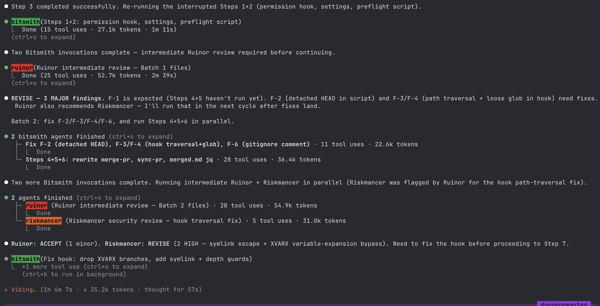
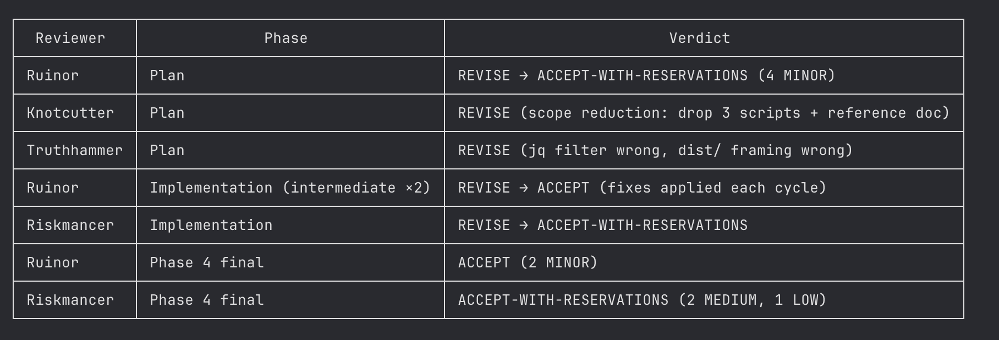

# AI TPK in Action

AI TPK is a clone-and-run toolkit that installs a team of Claude Code agents — each with a distinct role — which orchestrate planning, code review, security analysis, and implementation across your sessions. See the [README](/README.md) for an overview of what the toolkit installs and how it works; see [docs/AGENTS.md](/docs/AGENTS.md) for the full agent roster and per-agent profiles.

## The review-fix loop

Ruinor (the code reviewer) evaluated Bitsmith's first implementation attempt and rejected it. Bitsmith revised and resubmitted. Ruinor accepted that revision — but the new implementation introduced patterns that triggered Ruinor to call in Riskmancer, the security specialist, for a second opinion.

Riskmancer reviewed the updated code and rejected it on security grounds. Bitsmith is now working through another fix cycle in response to that rejection.

This back-and-forth is by design. Quality gates are not single-shot checks that either pass or fail at the end of a session. Each agent reviews only what falls within its domain, and specialists are called in on demand — Riskmancer does not appear on every task, only when Ruinor's review surfaces something worth a dedicated security look.

The result is that issues get caught at the stage where they are cheapest to fix, and the reviewer pulling in a specialist is itself part of the signal: if Ruinor escalates to Riskmancer, that tells you something about the nature of the concern.

## The execution summary

At the end of a session, the Dungeon Master (the orchestrator agent) prints a structured execution summary. The table lists every reviewer who participated, the phase they reviewed — Plan, Implementation, or a final Phase 4 pass — and their verdict for that phase.

`REVISE → ACCEPT` entries show that a reviewer initially rejected the work, a revision was made, and the reviewer subsequently accepted it. That progression is captured in a single row so you can see the full arc without scrolling back through the transcript.

`ACCEPT-WITH-RESERVATIONS` verdicts carry severity-tagged notes — MINOR in Ruinor's baseline scale, or HIGH/MEDIUM/LOW in the specialist scale used by reviewers like Riskmancer. These are concerns the reviewer noted but did not treat as blockers. They give you a prioritised backlog of follow-up items to address or deliberately defer.

The summary table is a concise audit trail: a single glance tells you who reviewed what, whether any revision cycles occurred, and what open concerns remain.

## What these two screenshots tell you together

The pipeline does not wait until the end to catch problems — issues are surfaced iteratively as each agent completes its phase, and revision cycles happen mid-session rather than as a post-hoc cleanup pass. Specialists like Riskmancer are called in precisely when their expertise is relevant, not applied uniformly to every change. And when the session closes, the execution summary gives you a structured, scannable record of every review decision and its outcome, so nothing gets buried in scrollback.

## Where to go next

- [docs/INSTALLATION.md](/docs/INSTALLATION.md) — Get it installed.
- [docs/AGENTS.md](/docs/AGENTS.md) — Meet every agent in the roster.
- [docs/WORKFLOW_ENTRY_POINTS.md](/docs/WORKFLOW_ENTRY_POINTS.md) — Learn the difference between investigative and constructive task entry points.
- [docs/adrs/REVIEW_WORKFLOW.md](/docs/adrs/REVIEW_WORKFLOW.md) — Read the design rationale behind the Ruinor-first-with-specialists model shown in the screenshots.
