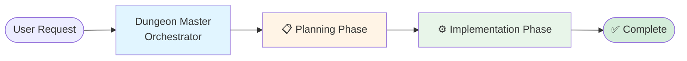
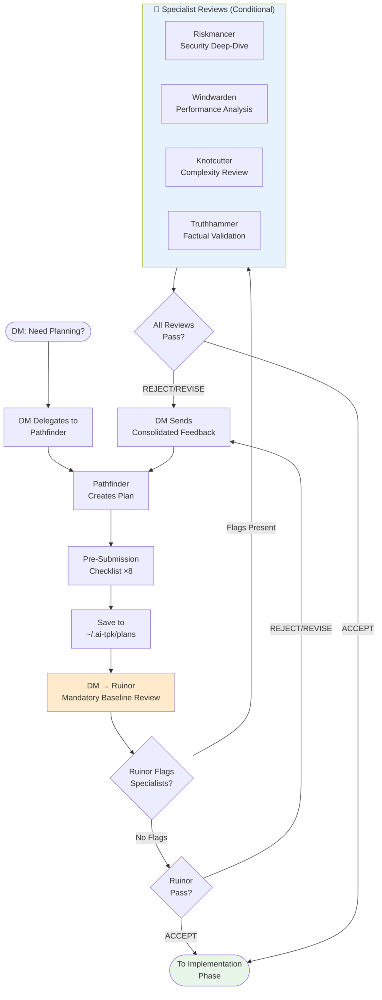
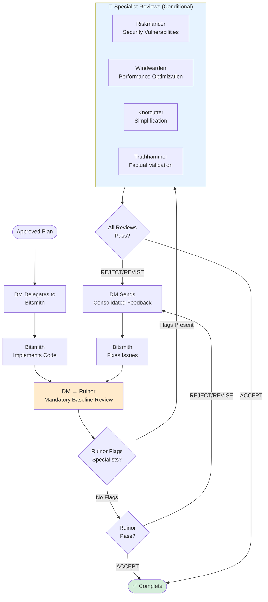

# Review Workflow Guide

## Overview

The AI TPK agent orchestration system uses an intelligent review workflow that replaces the old "4-mandatory-reviewers-on-every-change" model with a smart "Ruinor-first with opt-in specialists" approach. This dramatically reduces review overhead (60-70% fewer reviews on average) while maintaining the same quality rigor for complex changes.

## The Problem We Solved

**Old Workflow (Removed):**
- ALL changes went through 4 reviewers: Ruinor, Knotcutter, Riskmancer, Windwarden
- Plan review: 4 reviewers mandatory
- Implementation review: same 4 reviewers mandatory
- Total: 8 reviews minimum per feature
- **Problem**: 75% of reviews were wasted on simple changes

**Example:** A simple UI text change would be reviewed by:
1. Ruinor (quality) - useful
2. Knotcutter (complexity) - not needed for text change
3. Riskmancer (security) - not needed for text change
4. Windwarden (performance) - not needed for text change

Result: 3 out of 4 reviews provided no value, wasting time and tokens.

## The New Workflow

### Architecture

#### High-Level Overview



#### Planning Phase Detail



#### Implementation Phase Detail



### Review Agents

#### Ruinor - Mandatory Baseline Reviewer

**Always runs for:**
- ALL plan reviews
- ALL implementation reviews

**Provides:**
- Quality and correctness review
- Basic security checks (obvious injection, exposed secrets, basic OWASP)
- Basic performance checks (N+1 queries, obvious inefficiencies, missing indexes)
- Basic complexity checks (obvious over-engineering, YAGNI violations)
- **Specialist triage** - flags when deeper expertise is needed

**Configuration:** `mandatory: true`, `invoke_when: "all plan and implementation reviews"`

#### Riskmancer - Security Specialist

**Only runs when:**
- Ruinor flags security concerns beyond baseline checks, OR
- User explicitly requests with `--review-security` flag, OR
- Plan/code contains security keywords (heuristic fallback)

**Provides:**
- OWASP Top 10 deep analysis
- Advanced authentication/authorization review
- Cryptography and key management audit
- Payment processing and PII handling review
- Advanced injection pattern detection

**Configuration:** `mandatory: false`, `invoke_when: "security-sensitive features or when Ruinor flags security concerns"`

**Trigger keywords:** auth, authentication, authorization, session, jwt, token, password, crypto, encrypt, decrypt, secret, credential, payment, pii, personal data, api key, oauth, saml, security

#### Windwarden - Performance Specialist

**Only runs when:**
- Ruinor flags performance concerns beyond baseline checks, OR
- User explicitly requests with `--review-performance` flag, OR
- Plan/code contains performance keywords (heuristic fallback)

**Provides:**
- Algorithmic complexity analysis
- Database query optimization review
- Scalability pattern validation
- Caching strategy assessment
- Resource usage optimization

**Configuration:** `mandatory: false`, `invoke_when: "performance-critical features or when Ruinor flags performance concerns"`

**Trigger keywords:** database, query, performance, scale, scalability, optimization, cache, index, pagination, algorithm, batch, real-time, throughput, latency, memory, cpu

#### Knotcutter - Complexity Specialist

**Only runs when:**
- Ruinor flags complexity concerns beyond baseline checks, OR
- User explicitly requests with `--review-complexity` flag, OR
- Plan/code contains complexity keywords (heuristic fallback)

**Provides:**
- Architectural over-engineering detection
- Premature abstraction identification
- Radical simplification proposals
- YAGNI enforcement (deep analysis)
- Complexity reduction strategies

**Configuration:** `mandatory: false`, `invoke_when: "major refactors, new abstractions, or when Ruinor flags complexity concerns"`

**Trigger keywords:** refactor, architecture, abstraction, framework, pattern, generalize, reusable, complexity, simplify, redesign, restructure

#### Truthhammer - Factual Validation Specialist

**Only runs when:**
- Ruinor flags factual verification concerns about external system behavior, OR
- User explicitly requests with `--verify-facts` flag, OR
- Plan/code contains factual-validation keywords (heuristic fallback)

**Provides:**
- Config property verification for external services
- API signature validation for libraries and SDKs
- Version compatibility verification
- CLI flag and environment variable validation
- Cross-reference verification against official documentation

**Configuration:** `mandatory: false`, `invoke_when: "plans or code reference specific external system behavior, or when Ruinor flags factual verification concerns"`

**Trigger keywords:** changelog, breaking change, deprecated, upgrade path, migration guide, compatibility matrix, release notes

## Triggering Mechanisms

The workflow uses three triggering mechanisms (in priority order):

### 1. User Flags (Explicit Control) - HIGHEST PRIORITY

Users can explicitly request specialist reviews by adding flags to their request:

```bash
# Request specific specialist reviews
claude --agent dungeonmaster "Add OAuth login --review-security"
claude --agent dungeonmaster "Optimize database queries --review-performance"
claude --agent dungeonmaster "Refactor authentication module --review-complexity"

# Request all specialists
claude --agent dungeonmaster "Major feature overhaul --review-all"
```

**When user flags are present:**
- Specified specialists are ALWAYS invoked, regardless of other triggers
- Ruinor still runs first (mandatory baseline)
- User flags carry through from plan review to implementation review

### 2. Ruinor Recommendations (Primary Trigger) - PREFERRED

Ruinor's 6-phase investigation protocol includes **Phase 5: Specialist Assessment**, where it evaluates whether concerns extend beyond baseline checks.

**Example Ruinor output:**
```
### Specialist Recommendations

**Riskmancer (Security)**: Plan introduces JWT authentication without
explicit mention of token expiry, refresh strategy, or CSRF protection.
Recommend security specialist deep-dive.

**Windwarden (Performance)**: Proposed user search endpoint has no
pagination strategy and queries against unindexed email field.
Recommend performance specialist review.
```

**Orchestrator action:**
- Parses the "Specialist Review Recommended" field from Ruinor's output
- Invokes flagged specialists in parallel
- Collects verdicts from all reviewers

**Why this is preferred:**
- Ruinor has full context from thorough review
- Decisions based on actual findings, not keyword heuristics
- Adapts to codebase patterns over time

### 3. Keyword Detection (Heuristic Fallback) - LAST RESORT

If no user flags present AND Ruinor doesn't recommend specialists, the orchestrator checks plan/code content for specialist keywords.

**Security keywords:**
- auth, authentication, authorization, session
- jwt, token, password, crypto, encrypt, secret
- credential, payment, pii, oauth, api key

**Performance keywords:**
- database, query, scale, cache, index
- pagination, algorithm, batch, throughput

**Complexity keywords:**
- refactor, architecture, abstraction, framework
- pattern, redesign, restructure

**Limitations:**
- Less precise than Ruinor recommendations
- May miss context-dependent concerns
- Can produce false positives (e.g., "password" in documentation)

**Why it exists:**
- Safety net for cases where Ruinor misses a concern
- Catches obvious specialist-level work before implementation begins
- Better than no specialist review when needed

## Impact Metrics

### Efficiency Gains

**Simple changes (70% of workload):**
- Old: 8 reviews (4 plan + 4 implementation)
- New: 2 reviews (Ruinor only for both gates)
- **Reduction: 75%**

**Medium complexity (20% of workload):**
- Old: 8 reviews
- New: 4 reviews (Ruinor + 1 specialist at both gates)
- **Reduction: 50%**

**Complex changes (10% of workload):**
- Old: 8 reviews
- New: 4-10 reviews (Ruinor + 1-4 specialists at both gates)
- **Reduction: 0-50%**

**Average across typical workload:**
- **60-70% fewer reviews**
- **Same quality rigor for complex changes**
- **Faster iteration for simple changes**

### Quality Maintained

**Test case: JWT Authentication Feature**
- Old workflow: Would run 4 reviewers at each gate (Ruinor, Riskmancer, Windwarden, Knotcutter)
  - Riskmancer useful (found 8 security gaps)
  - Windwarden not needed (no performance concerns)
  - Knotcutter not needed (simple implementation)
- New workflow: Ran 2 reviewers at each gate (Ruinor, Riskmancer)
  - Ruinor flagged security concerns → triggered Riskmancer
  - Riskmancer found same 8 security gaps
  - **Result: Same quality, 50% fewer reviews**

## User Guide

### When to Use Review Flags

**Use `--review-security` when:**
- Adding or modifying authentication/authorization
- Implementing payment processing or PII handling
- Working with cryptography, encryption, or secrets
- Integrating external APIs with security boundaries
- Any feature where security is a primary concern

**Use `--review-performance` when:**
- Optimizing database queries or adding indexes
- Implementing pagination or caching strategies
- Working with large datasets or algorithmic complexity
- Building real-time or high-throughput features
- Any feature where performance is a primary concern

**Use `--review-complexity` when:**
- Refactoring across multiple files or systems
- Introducing new abstractions or architectural patterns
- Simplifying over-engineered code
- Any feature where complexity management is a concern

**Use `--review-all` when:**
- Major feature overhauls touching multiple domains
- High-risk changes requiring maximum scrutiny
- Not sure which specialists are needed (better safe than sorry)

### When to Trust Ruinor Alone

**Don't add flags when:**
- Making simple bug fixes or UI tweaks
- Updating configuration or documentation
- Making small, isolated changes
- Following established patterns without innovation

Ruinor will automatically flag specialists if your "simple" change has hidden complexity.

### Best Practices

1. **Start without flags** - Let Ruinor triage for you
2. **Add flags for known concerns** - If you know it's security-sensitive, say so
3. **Use `--review-all` for uncertainty** - Better to over-review than under-review on critical changes
4. **Trust the process** - Ruinor's recommendations are based on actual code review, not guesses
5. **Review the verdicts** - Pay attention to what specialists found and learn patterns

## Technical Implementation

See `claude/agents/dungeonmaster.md` for the orchestrator implementation and `claude/agents/{reviewer}.md` for each reviewer's metadata and trigger configuration.

## Migration Notes

### What Changed

**Removed:**
- Mandatory 4-reviewer gates on all changes
- Parallel invocation of all reviewers regardless of content
- 8 minimum reviews per feature

**Added:**
- Ruinor as mandatory baseline reviewer
- Specialist triggering via Ruinor recommendations (primary)
- User flags for explicit specialist requests
- Keyword-based heuristic fallback
- Agent metadata (`mandatory`, `trigger_keywords`, `invoke_when`)

**Unchanged:**
- Review verdict taxonomy (REJECT/REVISE/ACCEPT-WITH-RESERVATIONS/ACCEPT)
- Severity levels (CRITICAL/MAJOR/MINOR)
- Review quality standards and investigation protocols
- Plan and implementation review gates still exist
- Revision loops still iterate until all reviewers accept

### Backward Compatibility

The new workflow is fully compatible with existing:
- Agent definitions (metadata added but not required)
- Plan formats (no changes needed)
- Review output formats (specialist recommendations added to Ruinor)
- Orchestration logic (enhanced, not replaced)

Existing workflows continue to work; they just run more efficiently now.

## Key Principles

- **Plans are artifacts** - Saved to `~/.ai-tpk/plans/{repo-slug}/` for visibility and persistence
- **Reviews are ephemeral** - Verdicts returned in-memory, not saved to files
- **Quality gates enforce quality** - No execution without approved plan, no completion without approved implementation
- **Intelligent triage** - Ruinor provides mandatory baseline, specialists handle deep expertise
- **Revision loops** - Plans and code iterate until all reviewers accept
- **DM never implements** - All work is delegated to specialized agents
- **Hard intermediate review gates** - After 2 consecutive Bitsmith invocations, a review gate is mandatory before continuing
- **REJECT verdicts require remediation** - When Ruinor issues REJECT, Bitsmith must provide a written remediation brief before re-review to prevent rubber-stamp approvals
- **Documentation follows implementation** - Quill is invoked only after implementation review is fully complete; any post-documentation code changes must re-enter the implementation review gate

## Future Enhancements

Potential improvements to the review workflow:

1. **Machine learning-based triggering** - Learn from past reviews which specialists were most valuable
2. **Confidence scoring** - Ruinor could assign confidence to specialist recommendations
3. **Specialist combinations** - Some work benefits from specialist pairs (e.g., Riskmancer + Windwarden for database security)
4. **Review caching** - Skip re-review of unchanged portions of code
5. **Progressive review** - Start with Ruinor, add specialists incrementally based on findings

## References

- [Agent Reference](/docs/AGENTS.md) - Agent catalog and quick reference
- [Agent Operational Specs](/claude/agents/) - Detailed operational specs, tool lists, and workflows for each agent
- [Configuration Guide](/docs/CONFIGURATION.md) - Setup and customization
- [Dungeon Master Agent](/claude/agents/dungeonmaster.md) - Orchestration logic implementation
- [Ruinor Agent](/claude/agents/ruinor.md) - Baseline reviewer implementation
- [Specialist Agents](/claude/agents/) - Riskmancer, Windwarden, Knotcutter implementations
